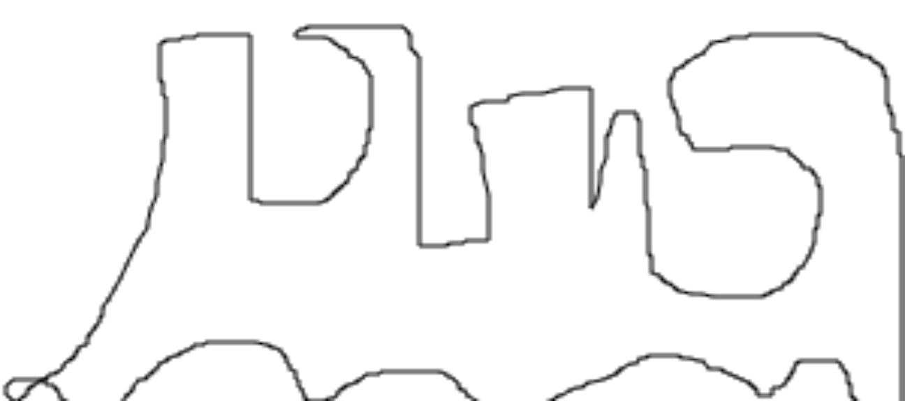

# JavaScript-drawing
This JavaScript-based project uses JavaScript as a drawing tool to bring to life HTML and CSS elements on a web browser.
The best thing about this project is that you can take advantage of JavaScript’s supercool drawing libraries like oCanvas, Canviz, Raphael, etc. 
By working on this project, you can learn how to use and implement JavaScript’s drawing capabilities. This skill will come in handy for enhancing the appeal of static pages by adding graphical elements to them.

Simple improvisation of JavaScript keywords to draw handsfree using the mouse

